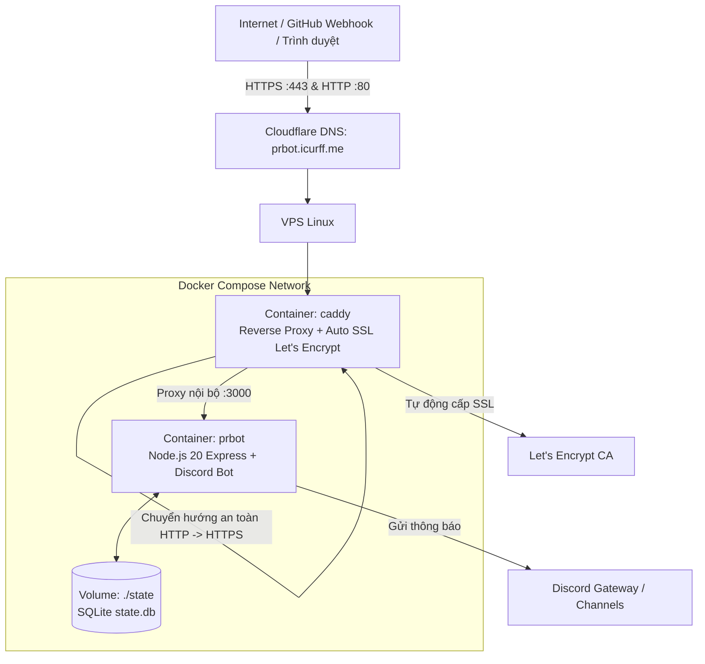

# Hướng Dẫn Triển Khai All-in-One 100% Docker + Caddy (Tự Động Cấp SSL Let's Encrypt)
### Domain: `prbot.icurff.me` — Hoạt động 24/7 trên VPS Linux

Tài liệu này hướng dẫn cách đưa hệ thống **RepoRelay (PR Notification Bot)** lên máy chủ Linux (Ubuntu/Debian) bằng giải pháp **Docker Compose + Caddy** khép kín 100%. 

Không cần cài Node.js, không cần cài Nginx, không cần cài Certbot trên máy chủ. Mọi thứ được đóng gói trong Docker, tự động xin chứng chỉ **SSL Let's Encrypt (HTTPS)** và tự động gia hạn vĩnh viễn.

---

## Kiến Trúc Hệ Thống (All-in-One Docker)



---

## Mục Lục
1. [Yêu Cầu Tiên Quyết](#1-yêu-cầu-tiên-quyết)
2. [Cấu Hình DNS Domain prbot.icurff.me](#2-cấu-hình-dns-domain-prboticuffme)
3. [Cài Đặt Docker & Docker Compose Trên VPS](#3-cài-đặt-docker--docker-compose-trên-vps)
4. [Tải Mã Nguồn & Tạo File .env](#4-tải-mã-nguồn--tạo-file-env)
5. [Khởi Chạy Toàn Bộ Hệ Thống Bằng 1 Lệnh (24/7)](#5-khởi-chạy-toàn-bộ-hệ-thống-bằng-1-lệnh-247)
6. [Cấu Hình Webhook Trên GitHub](#6-cấu-hình-webhook-trên-github)
7. [Kiểm Tra Trạng Thái & Web Dashboard](#7-kiểm-tra-trạng-thái--web-dashboard)
8. [Quy Trình Cập Nhật Code Khi Có Phiên Bản Mới](#8-quy-trình-cập-nhật-code-khi-có-phiên-bản-mới)
9. [Xử Lý Sự Cố Thường Gặp (Troubleshooting)](#9-xử-lý-sự-cố-thường-gặp-troubleshooting)

---

## 1. Yêu Cầu Tiên Quyết

- **Máy chủ VPS**: Ubuntu 22.04 LTS / 24.04 LTS hoặc Debian 12 (RAM tối thiểu 1GB).
- **Domain**: Sở hữu domain `icurff.me` (quản lý DNS trên Cloudflare hoặc nhà cung cấp tên miền).
- **Discord Bot**:
  - `DISCORD_BOT_TOKEN`: Lấy tại [Discord Developer Portal](https://discord.com/developers/applications).
  - Đã bật: **Server Members Intent** và **Message Content Intent**.
  - Đã mời bot vào server với quyền gửi tin nhắn, tạo thread.
  - `DISCORD_CHANNEL_PRS`: ID kênh nhận thông báo PR.

---

## 2. Cấu Hình DNS Domain `prbot.icurff.me`

Vào trang quản lý DNS (ví dụ: Cloudflare) và thêm 1 bản ghi:

| Loại (Type) | Tên (Name) | Địa chỉ IPv4 (Value) | Proxy status | TTL |
|:---:|:---:|:---:|:---:|:---:|
| **A** | `prbot` | `<Địa chỉ IP của VPS>` | **DNS Only** *(Tắt đám mây cam lúc đầu để Caddy xác thực SSL)* | Auto |

> [!TIP]
> Sau khi khởi chạy Caddy và thấy web đã có SSL xanh trên trình duyệt, nếu muốn bật lại Proxy Cloudflare (đám mây cam), hãy chuyển mục **SSL/TLS Encryption** trên Cloudflare thành **Full** hoặc **Full (Strict)**.

Kiểm tra tên miền đã nhận đúng IP máy chủ chưa:
```bash
ping prbot.icurff.me
```

---

## 3. Cài Đặt Docker & Docker Compose Trên VPS

Đăng nhập SSH vào máy chủ VPS của bạn:
```bash
ssh root@<IP_CỦA_VPS>
```

Cài đặt Docker và Docker Compose chính thức bằng script tự động của Docker:
```bash
sudo apt update && sudo apt install -y curl git
curl -fsSL https://get.docker.com -o get-docker.sh
sudo sh get-docker.sh

# Cho phép user chạy docker không cần gõ sudo
sudo usermod -aG docker $USER
```

Kiểm tra phiên bản:
```bash
docker --version
docker compose version
```

---

## 4. Tải Mã Nguồn & Tạo File `.env`

### File `.env` lấy ở đâu?
- File `.env` chứa các thông tin nhạy cảm (token bot, secret webhook) nên **không bao giờ được đẩy lên Git**.
- Dự án đã chuẩn bị sẵn file mẫu [`.env.example`](file:///c:/Users/Admin/Desktop/pr-noti-bot/.env.example).
- Khi đưa code lên VPS, bạn chỉ cần copy từ `.env.example` sang `.env` và điền token của mình.
- Docker Compose sẽ tự động đọc file `.env` đặt cùng thư mục để truyền biến môi trường vào container `prbot`.

### Các bước thực hiện trên VPS:

```bash
# 1. Tạo thư mục làm việc
sudo mkdir -p /var/www/pr-noti-bot
sudo chown -R $USER:$USER /var/www/pr-noti-bot
cd /var/www/pr-noti-bot

# 2. Clone mã nguồn từ GitHub của bạn
git clone <URL_GIT_CUA_BAN> .

# 3. Tạo thư mục lưu database SQLite trên máy chủ
mkdir -p state

# 4. Tạo file .env từ file mẫu .env.example
cp .env.example .env

# 5. Mở file .env để điền thông tin
nano .env
```

Nội dung file `.env` cần chỉnh sửa:
```env
# 1. Điền Token Bot Discord của bạn:
DISCORD_BOT_TOKEN="Điền_Token_Bot_Vào_Đây"

# 2. Điền ID kênh Discord nhận tin nhắn PR:
DISCORD_CHANNEL_PRS="1545271341438079077"

# 3. Chuỗi bí mật Webhook (đặt 1 chuỗi ngẫu nhiên dài để bảo mật):
GITHUB_WEBHOOK_SECRET="tao_mot_chuoi_secret_ngau_nhien_vd_9a8b7c6d5e4f"

# Các kênh tùy chọn khác (để trống nếu dùng chung kênh PRs):
DISCORD_CHANNEL_ISSUES=""
DISCORD_CHANNEL_RELEASES=""
DISCORD_CHANNEL_DEPLOYMENTS=""
DISCORD_CHANNEL_SECURITY=""

# Các tham số mặc định của container (giữ nguyên không cần sửa):
PORT=3000
HOST=0.0.0.0
STATE_DIR=/app/state
```

Nhấn `Ctrl + O` rồi `Enter` để lưu file, sau đó `Ctrl + X` để thoát.

---

## 5. Khởi Chạy Toàn Bộ Hệ Thống Bằng 1 Lệnh (24/7)

Tại thư mục `/var/www/pr-noti-bot`, bạn chỉ cần chạy:

```bash
docker compose up -d --build
```

### Điều gì sẽ diễn ra?
1. Docker tự động build image `prbot` (Node.js 20, tự build SQLite native addon C++).
2. Docker tải container `caddy` chính thức.
3. Container `prbot` chạy ngầm, kết nối tới Discord Gateway, sẵn sàng nhận webhook.
4. Caddy tự động liên hệ với Let's Encrypt, chứng minh quyền sở hữu domain `prbot.icurff.me`, tải chứng chỉ SSL về và tự động bật HTTPS trên cổng 443!
5. Cả 2 container đều có chính sách `restart: always` nên sẽ **tự động chạy lại 24/7** kể cả khi VPS bị khởi động lại.

### Các lệnh quản lý container hàng ngày:
```bash
# Kiểm tra trạng thái hoạt động của các container
docker compose ps

# Xem log hoạt động của Bot Discord (real-time)
docker compose logs -f prbot

# Xem log cấp chứng chỉ SSL và proxy của Caddy
docker compose logs -f caddy

# Khởi động lại Bot khi cần
docker compose restart prbot

# Dừng hệ thống
docker compose down
```

---

## 6. Cấu Hình Webhook Trên GitHub

Sau khi hệ thống chạy, tiến hành gắn Webhook vào Repository trên GitHub:

1. Vào GitHub Repository của dự án → Chọn tab **Settings** → Menu bên trái chọn **Webhooks**.
2. Nhấn nút **Add webhook**.
3. Điền các trường thông tin:
   - **Payload URL**: `https://prbot.icurff.me/webhook`
   - **Content type**: `application/json` *(bắt buộc)*
   - **Secret**: Nhập chính xác chuỗi `GITHUB_WEBHOOK_SECRET` bạn đã cấu hình trong file `.env`.
   - **SSL verification**: Chọn `Enable SSL verification`.
4. Mục **Which events would you like to trigger this webhook?**:
   - Chọn **Let me select individual events**:
     - [x] **Pull requests**
     - [x] **Pull request reviews**
     - [x] **Workflow runs**
     - [x] **Issues**
     - [x] **Releases**
     - [x] **Deployments**
     - [x] **Pushes**
     - [x] **Security alerts**
5. Đảm bảo ô **Active** được tick chọn.
6. Nhấn **Add webhook**.

GitHub sẽ gửi 1 ping request kiểm tra. Khi thấy biểu tượng tích xanh `✅ 200 OK` là kết nối thành công!

---

## 7. Kiểm Tra Trạng Thái & Web Dashboard

Mở trình duyệt truy cập:
👉 **`https://prbot.icurff.me`**

Bạn sẽ thấy:
- Trình duyệt hiển thị ổ khóa bảo mật **HTTPS** do Let's Encrypt cấp.
- **Bot Status**: `Online` kèm ping ms kết nối trực tiếp đến Discord Gateway.
- **Webhook Endpoint**: `https://prbot.icurff.me/webhook`.
- **HMAC Secret**: Báo trạng thái an toàn `Đã kích hoạt (HMAC-SHA256)`.
- **Kho Phản Ứng Media (GIF)**: 4 phân loại rõ ràng (`opened`, `approved`, `merged`, `needs_work`).
- **Webhook Simulator**: Cho phép bấm thử nghiệm bắn các sự kiện mô phỏng vào Discord ngay trên giao diện web.

---

## 8. Quy Trình Cập Nhật Code Khi Có Phiên Bản Mới

Mỗi khi bạn commit code mới lên GitHub, việc cập nhật trên VPS diễn ra cực kỳ đơn giản:

```bash
cd /var/www/pr-noti-bot

# 1. Kéo code mới nhất về
git pull

# 2. Rebuild và khởi động lại container tự động (không làm mất database)
docker compose up -d --build
```

Dữ liệu database SQLite lưu tại thư mục `state/` trên VPS được gắn volume cố định nên hoàn toàn không bị ảnh hưởng khi build lại image.

---

## 9. Xử Lý Sự Cố Thường Gặp (Troubleshooting)

### 1. Caddy không lấy được chứng chỉ SSL
- **Nguyên nhân**: Cổng 80 hoặc 443 bị chiếm dụng bởi service khác (như Apache, Nginx cũ cài trên VPS) hoặc do bản ghi DNS chưa trỏ đúng IP.
- **Khắc phục**:
  ```bash
  # Tắt Apache/Nginx cũ nếu có
  sudo systemctl stop nginx apache2 2>/dev/null
  sudo systemctl disable nginx apache2 2>/dev/null

  # Kiểm tra log chi tiết của Caddy
  docker compose logs caddy
  ```
  Đảm bảo trên Cloudflare bản ghi `prbot` đang ở trạng thái **DNS Only** (đám mây xám).

### 2. Bot Discord báo crash hoặc không online
- **Nguyên nhân**: Token bot trong file `.env` bị sai, hoặc thiếu intents trên Discord Developer Portal.
- **Khắc phục**:
  ```bash
  docker compose logs prbot
  ```
  Kiểm tra lại `DISCORD_BOT_TOKEN` trong file `.env`. Vào Discord Developer Portal bật lại **Server Members Intent** và **Message Content Intent**.

### 3. GitHub báo `401 Unauthorized: Invalid signature`
- **Nguyên nhân**: Chuỗi Secret trên GitHub không trùng với biến `GITHUB_WEBHOOK_SECRET` trong file `.env`.
- **Khắc phục**: Kiểm tra và đồng bộ lại chuỗi Secret ở cả 2 nơi.
